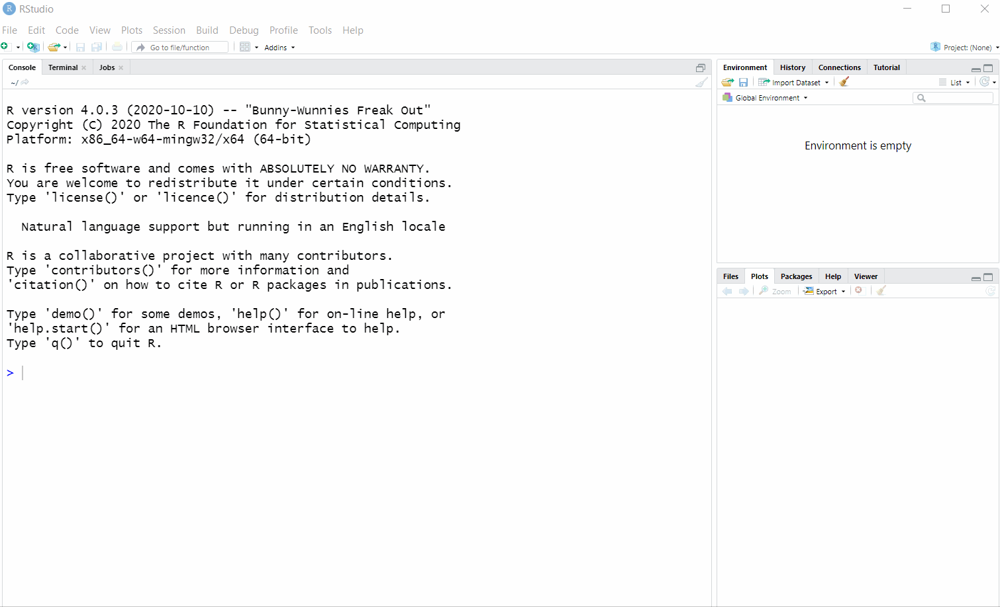

### Creating a project

One of the great tools in RStudio is the ability to make a 'project' folder that contains all your code and data. By organising your analyses into
projects not only are your files easy to find but you can share projects with colleagues without having to change the working directory.

Below is a animation that shows you:

* how to make a new project
* how new scripts will automatically be saved within that the project folder
* how when you open the project you will first have to click on the project icon before being able to access your script

To view the animation in full size right click on the animation and choose **View image** or **Open image** (the exact term will be different depending on your internet browser).


```
[BACK to INDEX](index.md)
