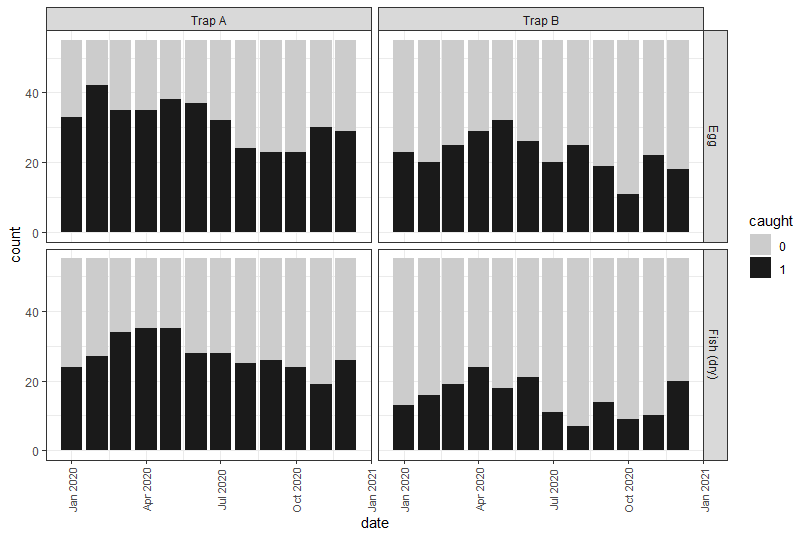
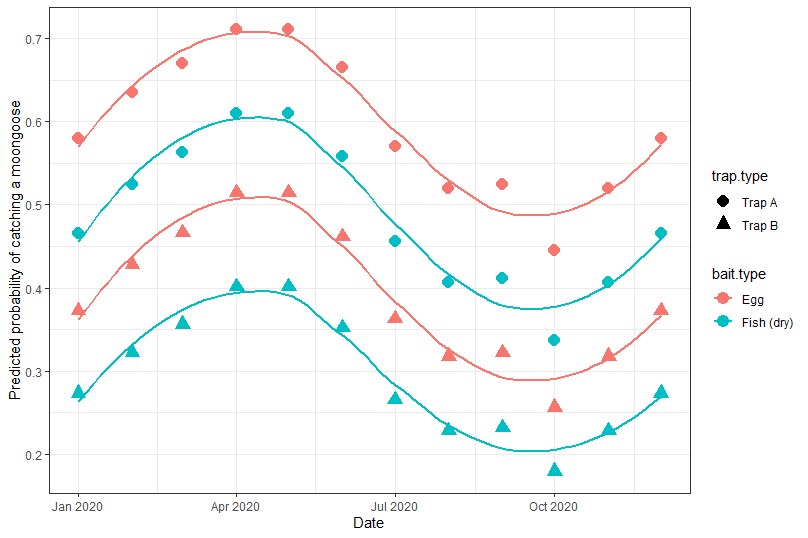

## The pattern in the "traps" data

There is a very strong pattern hidden in the `traps` data set within the `condev` package. Let's try to reveal it (or at least an approximate it). We will need the `tidyverse` and `AICcmodavg` packages in addition to `condev`:

```r
library("condev")
library("tidyverse")
library("AICcmodavg")
```

Next we will need to load the data:
```r
data(traps)
```

Patterns in binary data can be hard to visualise, however, underlying patterns are often revealed by graphs using summarised data. However, we shouldn't use this data for model selection -- we still want to use our original data. We begin by summarising the total catch associated with each trap location:

```r
summary <- traps %>%
  group_by(long, lat) %>%
  summarise(annual.catch = sum(trap.catch))
```

Next we should make a binary category based on `traps$trap.catch`:
```r
traps$caught <- as.factor(traps$trap.catch)
```

Now we can make a ggplot looking at bait (Egg or Fish) and trap type (A or B) combinations:

```r
ggplot()+
  geom_bar(data = traps, aes(x = date, fill = caught))+
  facet_grid(bait.type ~ trap.type)+
  theme_bw()+
  scale_fill_manual(values = c("grey80", "grey10"))+
  theme(axis.text.x= element_text(size = 8, 
        angle = 90, vjust = 0.5))
```
Which results in:




And yeah, there looks to be a pattern with some clear differences between the trap types and bait types.
Additionally, it looks a like trap catch could be higher in the first half of the year compared to the second half -- but this might just be our imagination.

Now we might try some modelling using **glm** using model selection (see page 238). Here will use `date` as as factor:

```r
# setup a subset of models of Table 1
Cand.models <- list( )

# set out of candidate model target

Cand.models[[1]] <- glm(trap.catch ~ bait.type + trap.type + as.factor(date) + cover,
                        data = traps, family = "binomial")
Cand.models[[2]] <- glm(trap.catch ~ bait.type + trap.type + as.factor(date),
                        data = traps, family = "binomial")
Cand.models[[3]] <- glm(trap.catch ~ trap.type + as.factor(date),
                        data = traps, family = "binomial")
Cand.models[[4]] <- glm(trap.catch ~ bait.type + as.factor(date),
                        data = traps, family = "binomial")
Cand.models[[5]] <- glm(trap.catch ~ bait.type ,
                        data = traps, family = "binomial")
Cand.models[[6]] <- glm(trap.catch ~ trap.type ,
                        data = traps, family = "binomial")
Cand.models[[7]] <- glm(trap.catch ~ bait.type + trap.type,
                        data = traps, family = "binomial")
Cand.models[[8]] <- glm(trap.catch ~ cover,
                        data = traps, family = "binomial")
Cand.models[[9]] <- glm(trap.catch ~ 1 ,
                        data = traps, family = "binomial")


# create a vector of names to trace back models in set
Modnames <- paste("mod", 1:length(Cand.models), sep = " ")

# AIC table to 4 digits
aictab(cand.set = Cand.models, modnames = Modnames, sort = TRUE)
```

Now for the sake of brevity I will skip the disgnostics and look at the predictions made by the top model using the **fitted()** function. 
I've made a copy of the original `traps` data now called `our.model` so that i can attached the predictions without altering the original data set:

```r
our.model <- traps
our.model$prediction <- fitted(Cand.models[[2]])
```
Now we can graph the predictions to understand the pattern being predicted:

```r
ggplot()+
  geom_point(data = our.model, aes(x= as.Date(date), y= prediction, colour =bait.type,
                                    shape =trap.type), size = 4)+
  geom_smooth(data = our.model, aes(x= as.Date(date), y= prediction, colour =bait.type,
                                     shape =trap.type), fill =NA) +
  theme_bw()+
  xlab("Date")+
  ylab("Predicted probability of catching moongoose")
 ```
 Which results in:
 
 
 
 Clearly there seems to be a strong seasonal pattern with differences between the bait and trap types.
 
 [BACK to INDEX](index.md)
